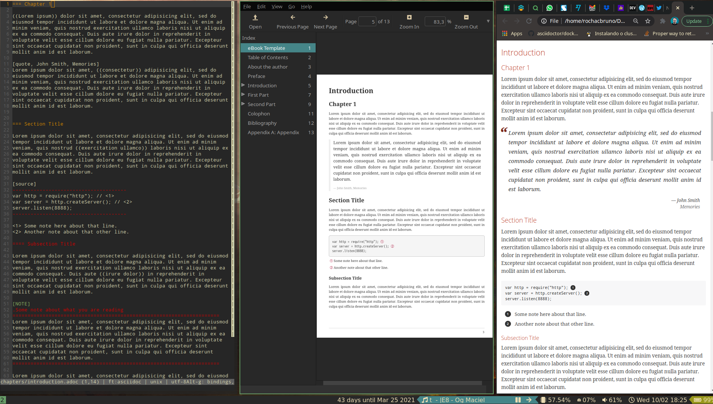

# Template for Writing an eBook

- Has book template(asciidoc) for creating html, pdf, epub/mobi.
- Uses [asciidoctor](http://asciidoctor.org) to make the book.
- See `master.adoc`


## Edit


```bash
git clone git://github.com/rochacbruno/asciidoctor-book-template.git
cd asciidoctor-book-template
vim master.doc chapters/about.adoc chapters/preface.adoc
```

Once all your files are edited.


## Generate the book

```bash
docker run -it -v $PWD:/documents/ asciidoctor/docker-asciidoctor

# Inside docker container bash

# PDF
asciidoctor-pdf -vwt -o output/mybook.pdf master.adoc

# EPUB
asciidoctor-epub3 -vwt -o output/mybook.epub master.adoc

# HTML
asciidoctor -vwt -o output/mybook.html master.adoc
```

## Auto run on every file change

```bash
find . -name '*.adoc' | entr docker run --rm -v $PWD:/documents/ asciidoctor/docker-asciidoctor asciidoctor-pdf -vwt -o output/mybook.pdf master.adoc 
```

## Learn more

- [Quick guide on syntaxes](http://asciidoctor.org/docs/asciidoc-syntax-quick-reference/)



